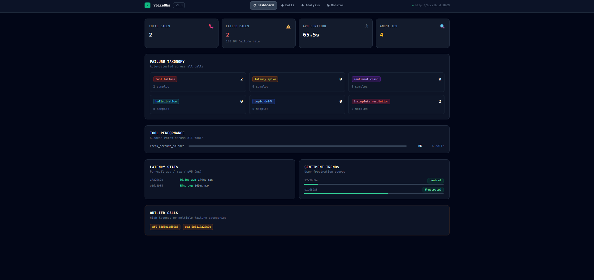
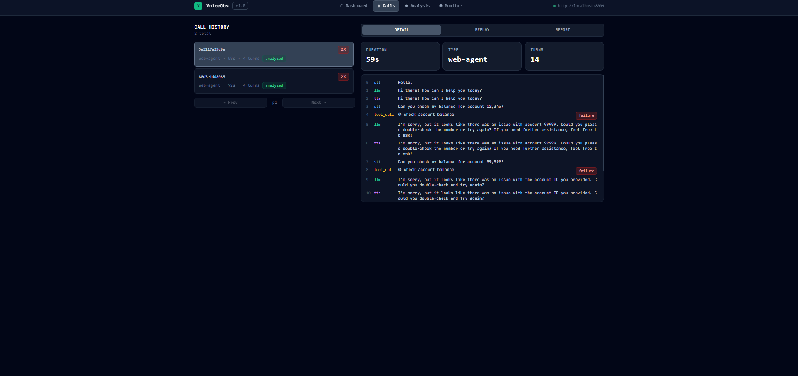
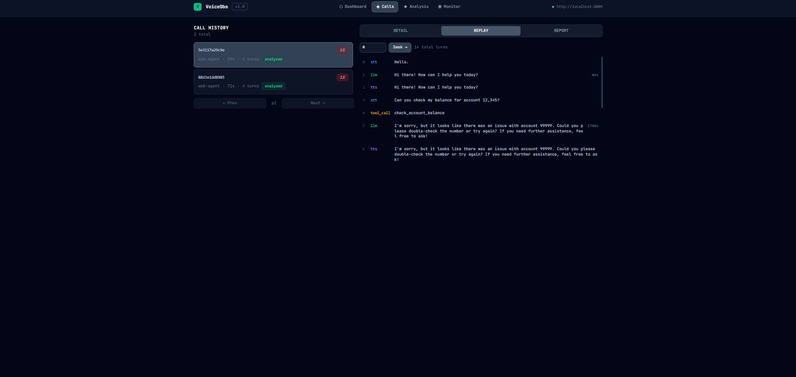
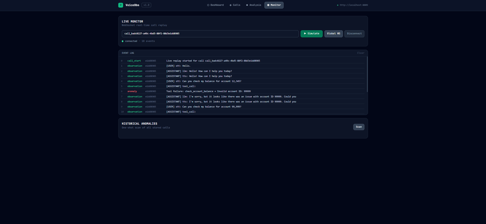
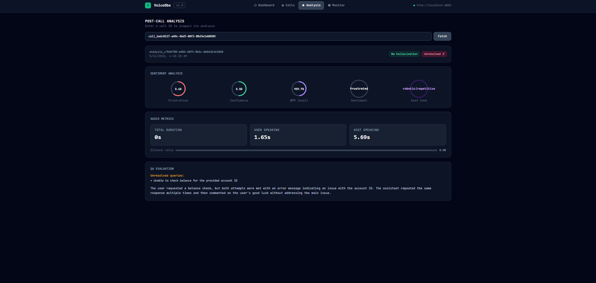
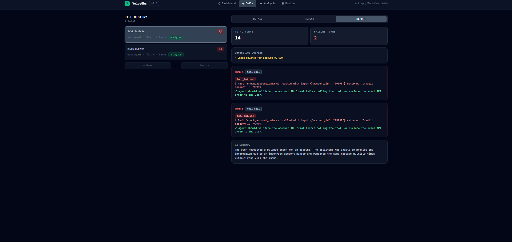

# VoiceObs — Voice Agent Observability Dashboard

> A real-time observability and post-call analytics dashboard for voice AI agents.  
> Built with React + Tailwind CSS, backed by a REST/WebSocket API.

---

## Overview

VoiceObs gives you full visibility into every conversation your voice agent handles — from high-level KPIs to turn-by-turn replay, failure analysis, sentiment scoring, and live WebSocket monitoring.



---

## Features at a Glance

| Feature | Description |
|---|---|
| **Dashboard** | Fleet-wide KPIs, tool performance, latency stats, sentiment trends, outlier call detection |
| **Calls** | Paginated call history, per-call detail, turn-by-turn replay with seek, failure reports |
| **Analysis** | Post-call deep dive: sentiment gauges, audio metrics, QA evaluation, hallucination detection |
| **Monitor** | Live WebSocket event stream, call simulation, historical anomaly scan |

---

## Screenshots

### Dashboard

The main overview screen shows aggregated metrics across all calls — total calls, failure rate, average duration, anomaly count, tool success rates, and per-call latency and sentiment breakdowns.


**What you see:**
- **KPI cards** — Total Calls, Failed Calls (with failure rate %), Avg Duration, Anomalies detected
- **Failure Taxonomy** — Auto-detected failure categories: `tool_failure`, `latency_spike`, `sentiment_crash`, `hallucination`, `topic_drift`, `incomplete_resolution`
- **Tool Performance** — Success rate bar per tool; green > 80%, amber > 50%, red below
- **Latency Stats** — Per-call avg / max latency (ms), highlighted red if max > 3000 ms
- **Sentiment Trends** — Per-call frustration score bar + positive/negative label
- **Outlier Calls** — Call IDs flagged for high latency or multiple failure categories

---

### Call History & Details

Browse all recorded calls, click any entry to load its full observation log.



**What you see:**
- **Left panel** — Paginated call list (15 per page) showing call ID, type, duration, turn count, tool failure count, and an "analyzed" badge if post-call analysis exists
- **Right panel** — Three tabs: `DETAIL`, `REPLAY`, `REPORT`
- **DETAIL tab** — Duration, call type, total turns, full observation log with per-turn type color coding:
  - `stt` (speech-to-text) → blue
  - `llm` (LLM response) → green
  - `tts` (text-to-speech) → purple
  - `tool_call` → amber

---

### Call Replay

Step through any call turn by turn, or jump directly to a specific turn index.



**What you see:**
- **Seek control** — Enter a turn number and jump directly to it; displays turn type, role, content, latency, and tool output
- **Full replay timeline** — All turns listed with latency in ms; turns exceeding 3000 ms highlighted in red
- Tool call turns show tool name and output inline

---

### Failure Report

Per-call failure analysis with root cause categorisation, unresolved queries, and hallucination detection.



**What you see:**
- Total turns vs failure turns count
- Hallucination alert banner (duplicate LLM response detection)
- Unresolved queries list
- Per-failure-turn breakdown with:
  - Turn index + type badge
  - Quoted content from that turn
  - Root cause category badge (colour-coded)
  - `what_happened` — what went wrong
  - `what_should_happen` — the expected behaviour
- QA Summary — free-text summary of call quality

---

### Post-Call Analysis

Deep per-call analysis: sentiment scoring, audio metrics, and QA evaluation.



**What you see:**
- **Sentiment gauges (circular):**
  - User frustration score (0–1)
  - User confidence score (0–1)
  - Assistant speech rate (WPM)
  - User sentiment label (positive / negative / neutral)
  - Assistant tone label
- **Audio Metrics:**
  - Total call duration (seconds)
  - User speaking time (seconds)
  - Assistant speaking time (seconds)
  - Silence ratio bar
- **QA Evaluation:**
  - Hallucination flag (`HALLUCINATING` / `No hallucination`)
  - Resolution flag (`Answered ✓` / `Unresolved ✗`)
  - Unresolved queries list
  - Conversation summary

---

### Live Monitor

Real-time WebSocket stream of call events with per-event severity colouring and a one-shot historical anomaly scanner.



**What you see:**
- **Controls:** Enter a call ID to connect to a call-specific WebSocket, or connect to the global WebSocket for all events
- **Simulate button** — Fires a `/monitor/simulate/{call_id}` POST and streams events live
- **Connection status dot** — green (connected), grey (disconnected), red (error)
- **Event log** — scrollable, monospace, up to 200 events retained:
  - Event index, event type, short call ID, message
  - `critical` → red, `warning` → amber, `info` → green
- **Historical Anomalies** — Scan button triggers `/monitor/anomalies`; displays up to 40 anomaly events with severity badge, call ID, and message

---

## Architecture

```
VoiceObsDashboard.jsx
├── App                  # Top-level shell — sticky nav, view router
├── DashboardView        # /analysis/dashboard + /calls/failures + /monitor/anomalies
├── CallsView            # /calls (paginated) + /calls/:id + /calls/:id/replay + /analysis/:id/report
├── AnalysisView         # /analysis/:id
└── MonitorView          # WebSocket /monitor/ws[/:id] + /monitor/simulate/:id + /monitor/anomalies
```

### Shared Components

| Component | Purpose |
|---|---|
| `StatCard` | KPI tile with label, large value, optional sub-text and icon |
| `Badge` | Inline pill tag with configurable colour classes |
| `Sparkline` | Lightweight SVG mini-chart for trend data |
| `SectionHeader` | Section title + subtitle + optional action slot |
| `Skeleton` | Animated loading placeholder |
| `CircleGauge` | SVG donut gauge for sentiment scores (AnalysisView) |

### Colour Coding

**Failure categories:**

| Category | Colour |
|---|---|
| `tool_failure` | Red |
| `latency_spike` | Amber |
| `sentiment_crash` | Purple |
| `hallucination` | Cyan |
| `topic_drift` | Blue |
| `incomplete_resolution` | Rose |

**Severity levels (Monitor / Anomalies):**

| Severity | Colour |
|---|---|
| `critical` | Red |
| `warning` | Amber |
| `info` | Green |

---

## API Reference

All requests target `http://localhost:8009` by default (set via `API_BASE`).

| Method | Endpoint | Used By |
|---|---|---|
| `GET` | `/analysis/dashboard` | Dashboard — fleet KPIs, tool stats, latency, sentiment |
| `GET` | `/calls/failures` | Dashboard — failure taxonomy counts and sample IDs |
| `GET` | `/monitor/anomalies` | Dashboard + Monitor — anomaly event list |
| `GET` | `/calls?page=&page_size=` | Calls — paginated call list |
| `GET` | `/calls/:id` | Calls — full call detail with observations |
| `GET` | `/calls/:id/replay` | Calls — full turn-by-turn replay |
| `GET` | `/calls/:id/seek?turn=` | Calls — single turn lookup |
| `GET` | `/analysis/:id` | Analysis — per-call sentiment, audio, QA analysis |
| `GET` | `/analysis/:id/report` | Calls / Report tab — failure report with root causes |
| `WS` | `/monitor/ws` | Monitor — global live event stream |
| `WS` | `/monitor/ws/:id` | Monitor — call-specific live event stream |
| `POST` | `/monitor/simulate/:id` | Monitor — trigger call simulation |

---

## Getting Started

### Prerequisites

- Node.js 18+
- A running VoiceObs API server at `http://localhost:8009`
- Tailwind CSS configured in your project

### Installation

```bash
# Install dependencies
npm install

# Start the dev server
npm run dev
```

The dashboard will be available at `http://localhost:5173` (or your configured Vite port).

### Changing the API URL

Edit line 3 of `VoiceObsDashboard.jsx`:

```js
const API_BASE = "http://localhost:8009";
```

---

## Tech Stack

- **React** (hooks: `useState`, `useEffect`, `useRef`, `useCallback`)
- **Tailwind CSS** — dark slate palette, utility-first styling
- **Native WebSocket API** — live event streaming in MonitorView
- **SVG** — Sparkline mini-charts and CircleGauge sentiment dials
- **JetBrains Mono / Fira Code** — monospace font for all data values

---

## License

MIT